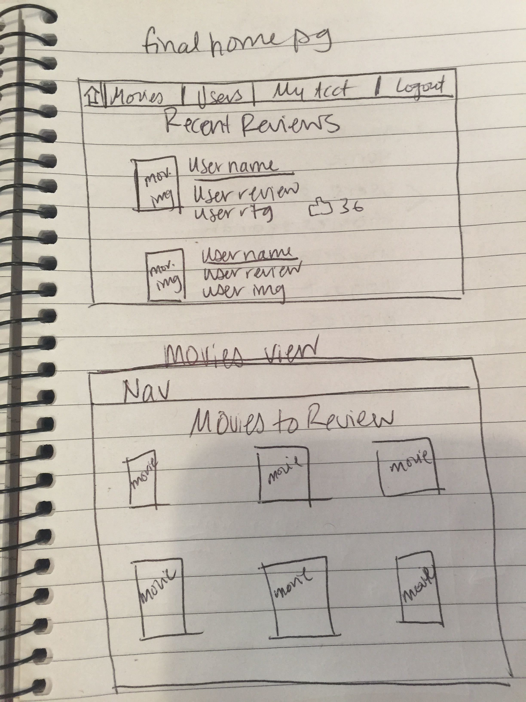
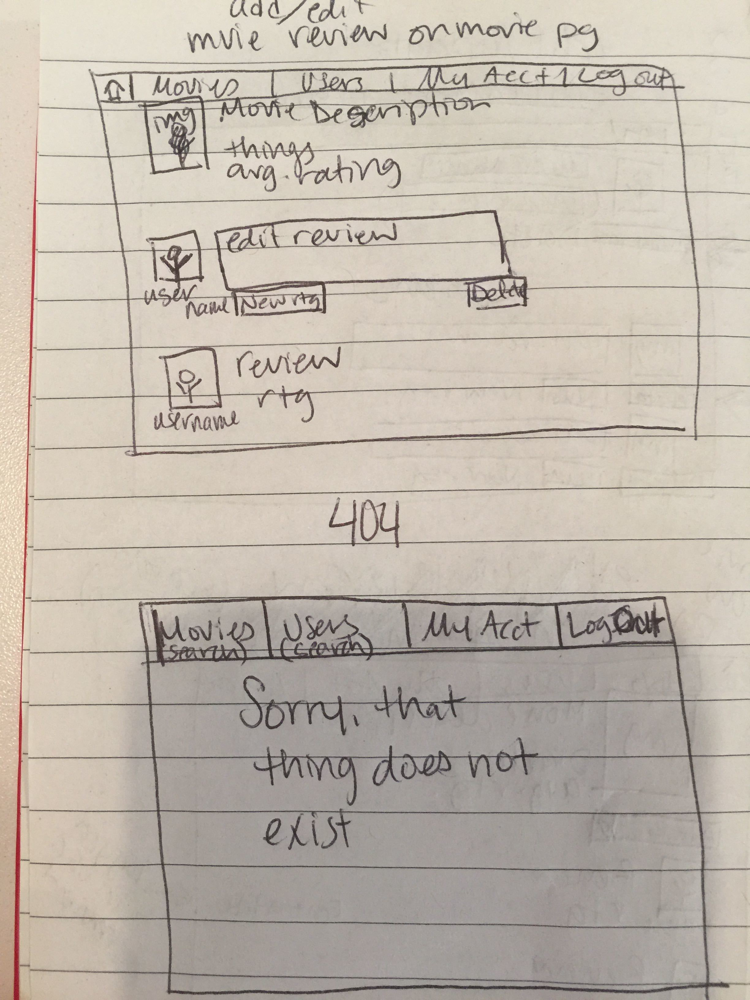
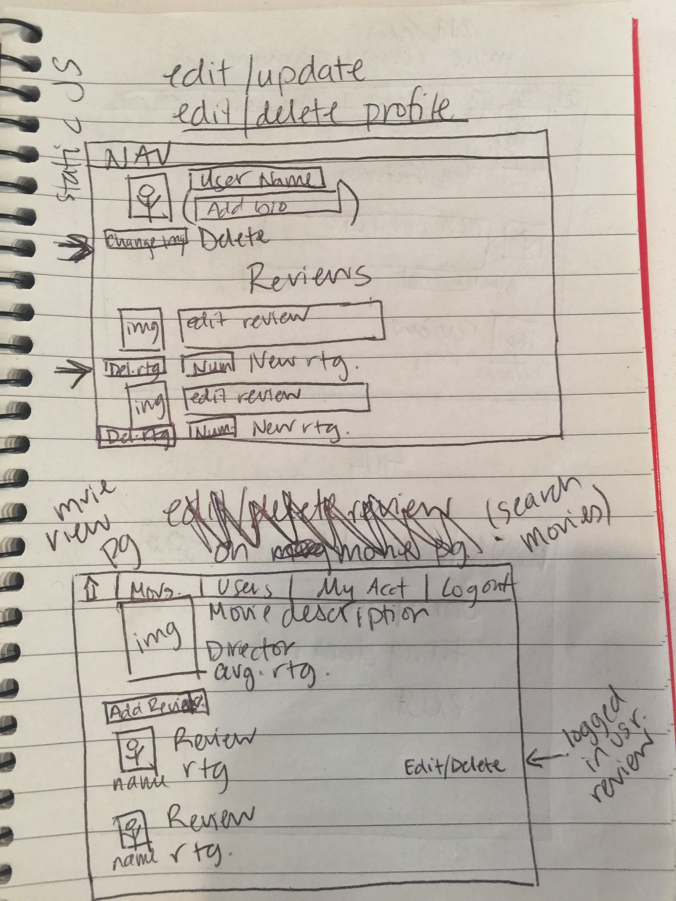
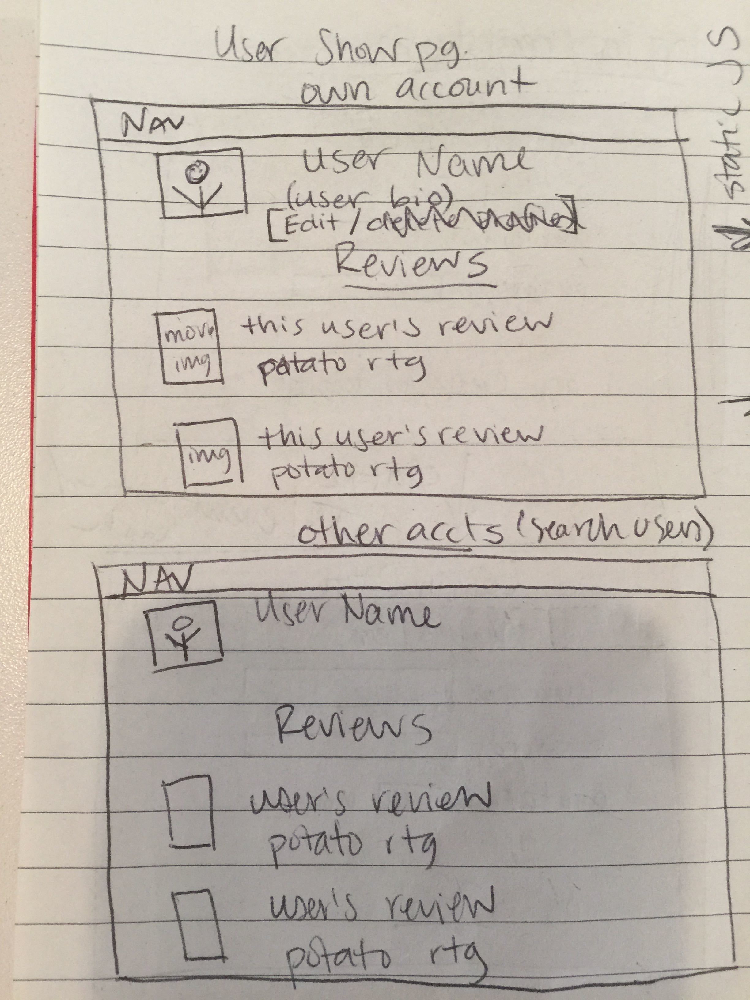
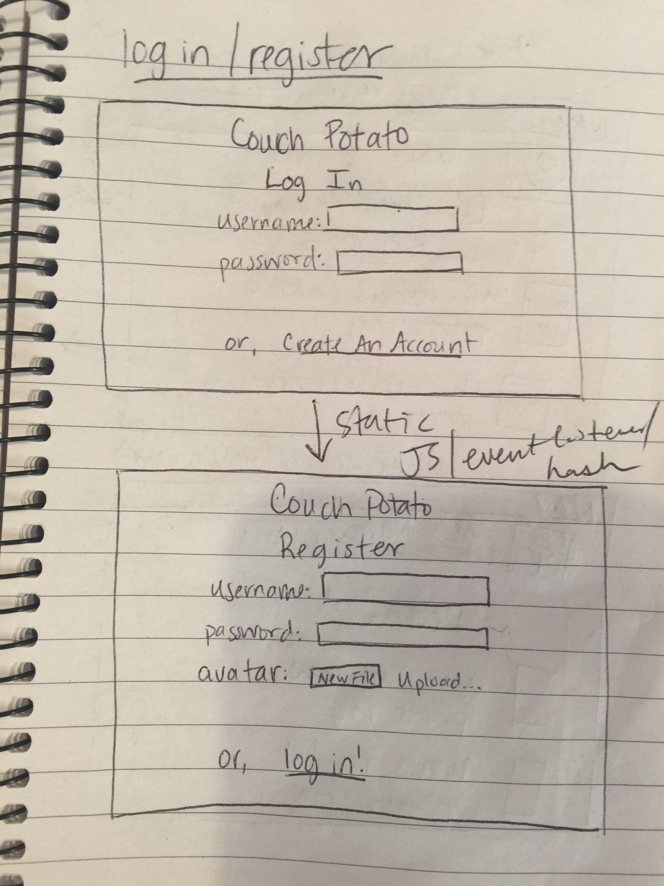

# couch-potato
A Movie Rating App
•	User should be able to create an account
o	User should be able to choose a username, password and avatar (upload image or default image)
•	User should be able to delete an account
•	User should be able to edit their account username, avatar
•	User should be able to log into their account using a username and password
•	User should be able to click on their name wherever it appears to see their account page?
•	User should be able to see their show page “My Account” that lists their info and reviews and edit/delete account from there
•	User should be able to edit/delete avatar
•	User should be able to edit/delete reviews from user page and from movie page
•	User should be able to see a home page (index.ejs)
•	User should be able to click on a movie on the home page (index.ejs)
•	User should be able to see a navigation bar including (movies, users, your profile, logout)
•	User should be able to see other profiles and reviews
•	User should be able to see pages for individual movies 
•	User should be able to add reviews to movies on movie show page
•	User should be able to edit reviews
•	User should be able to delete reviews
•	User should be able to add a potato rating to their review
•	User should be able to see an average potato rating
•	User should be able to search for other users
•	User should be able to search for movies
•	User should be able to see a 404 page if something goes wrong
•	User should be able to see nav on every page
•	User should be able to see a home page (feed)
•	User should be able to click on movies/ users on the feed and go to their respective pages

Dates to reviews
Bio to person

•	Secondary goals
•	Like/dislike reviews
•	Passwords match
•	More avatars
•	User bio 
•	Potato logo?

